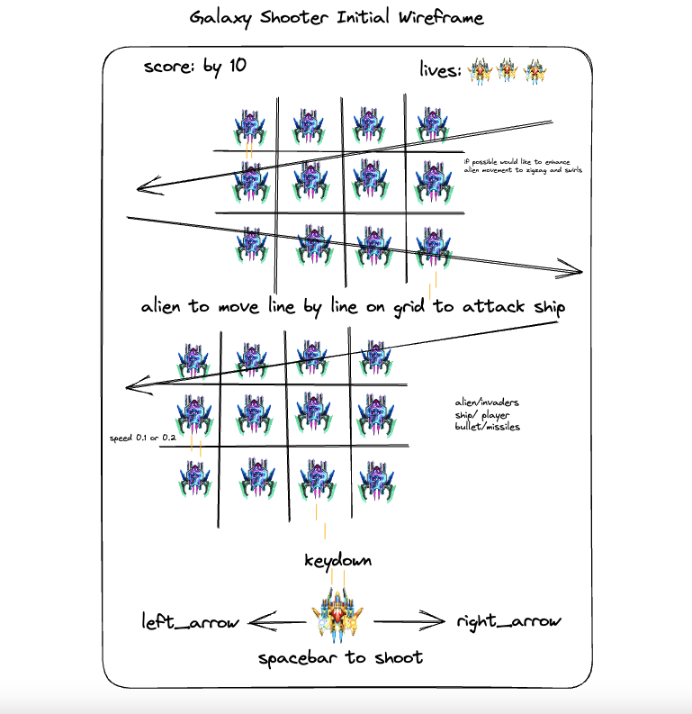

# GALAXY SHOOTER
A space invader game inspired by Galaga. 

 

### Get ready to embark on a space combat mission with your starship! Travel through the galaxy and take down waves of alien formations. Navigate through a barrage of enemy fire and engage in an epic shoot-out!

Prepare to lead your sky force into a fierce space battle and maneuver through a chaotic assault in our alien shooter game! With only you and your space team as the galaxy's last hope, it's up to you to restore peace and fend off the alien invaders! Fire away and repel their attacks on the galaxy!

To play Galaxy Shooter online visit kacyphan7.github.io 

# HOW TO PLAY
1. Use the `arrow keys` or `wasd` to move your starship around the screen.
2. Press the `space bar` to fire your ship's weapon and destroy enemy formations.
3. Dodge enemy fire to avoid game over.
4. Defeat all enemies to gain points.
5. The game ends when alien reached the bottom of the screen, when player is hit by alien bullet, or player collided with alien.
6. Press `restart button` to restart game including new score and clear aliens off the screen.

# LICENSE 
(CC0 1.0 Universal) You're free to use this game and code in any project, personal or commercial. There's no need to ask permission before using these. Giving attribution is not required, but is appreciated.

### Disclaimer

I do not own any of the images. Please reference to Credits section below for references. This project was modeled off of Galaga for nostalgic purposes. It was my favorite game to play on the BlackBerry SideKick when I first came to America. 

# HOW TO INSTALL 
1. `Fork` and `Clone` this respository to your local machine
2. Open `index.html` in your browser to play or
3. Open the directory in your text editor of choice to view or edit the code

## GAME SCREEN


# HOW IT WORKS

This code is an implementation of a simple 2D shooting game. Galaxy Shooter is built using HTML, CSS, and JavaScript. The game uses the HTML5 Canvas API to update the game graphics and handle player input. JavaScript is used to manage the game state, including tracking the player's score, lives, and level. The game is played by controlling a spaceship to shoot down aliens while dodging their bullets. The main logic of the game is handled in a function called `gameLoop`, which is called every 60 milliseconds using the `setInterval` method.

The code creates three classes to handle the entities: `Player`, `Alien`, and `Bullet`. `Player` handles the player spaceship, `Alien` handles the alien spaceships, and `Bullet` handles the bullets fired by both the player and the aliens.

The player spaceship is controlled using the `arrow keys` or `wasd` and fires bullets `vertically` upward by pressing the `space bar`. The alien spaceships are automatically generated at the top of the screen and move `horizontally` across the screen, firing bullets downwards randomly. The game ends if the player's spaceship is hit by an alien bullet or if an alien spaceship reaches the bottom of the screen.

Draw bullet 
``` javascript
draw() {
    ctx.beginPath();
    ctx.fillStyle = "#DEFA69";
    ctx.rect(this.x, this.y, this.width, this.height);
    ctx.fill();
    ctx.closePath();
  }
```
Update bullet 
``` javascript
update() {
    this.y += this.dy;
  }
```
Destroy bullet 
``` javascript
destroy() {
    // Remove bullet from list of active bullets
    let index = bulletList.indexOf(this);
    if (index !== -1) {
      bulletList.splice(index, 1);
    }
  }
```

In the game, players must defend against a row of alien enemies that will descend towards the screen every 5 seconds. Additionally, a new row of aliens will appear every 10 seconds, creating a continuous loop until the game is over using the `setInterval` method.

Create array of aliens to add a row of aliens 
``` javascript
let alienList = [];
```

Add new row of alien in loop 
``` javascript
function createAlienRow(startX, startY) {
  let aliens = [];

  for (let i = 0; i < 6; i++) {
    let alien = new Alien(alienImage, startX + i * 60, startY);
    aliens.push(alien);
  }

  return aliens;
}
```

setInterval method for Alien rows
``` javascript
// add first row every 5 seconds
setInterval(function () {
  let newAliens = createAlienRow(50, 0, 6);
  alienList = alienList.concat(newAliens);
}, 5000);

// add first row every 10 seconds
setInterval(function () {
  let newAliens = createAlienRow(50, 0, 6);
  alienList = alienList.concat(newAliens);
}, 10000);
```

The game detects collisions between entities using the `detectHit` function. The game also displays the player's score and updates it as they shoot down aliens.

In summary, this code creates a simple 2D shooting game where the player controls a spaceship to shoot down aliens while dodging their bullets. The game is played on an HTML canvas and the `getContext` method to create a game board using the `draw` and `update` methods to create and move the entities.

# FUTURE ENHANCEMENT
- Dynamic score labels for level and waves
- Bombs
- Machine gun power up 
- Spaceship sprite animation 
- Start and game over UI 
- Sound effects and music 

# PROCESS WORK

### Initial Wireframes:
 

# Credits 

AlienShooter.org. (n.d.). Element Lord [Digital image]. Retrieved from https://alienshooter.org/Element_Lord

Alien Shooter Wiki. (n.d.). Cyber Blade. Retrieved April 6, 2023, from https://alienshooter.org/Cyber_Blade

Chris Courses. (2018, April 27). HTML, CSS, & JavaScript - Creating a Quiz [Video]. YouTube. https://www.youtube.com/watch?v=MCVU0w73uKI&ab_channel=ChrisCourses

CodingWithAdam. (2023, April 7). JavaScript 2D Shooting Game Tutorial (HTML5 Canvas & Vanilla JS). [Video]. YouTube. https://www.youtube.com/watch?v=i7FzA4NavDs&ab_channel=CodingWithAdam

Laws, A. (2019, March 17). How to Code Space Invaders (1978) #7 [Blog post]. Codeheir. Retrieved from https://codeheir.com/2019/03/17/how-to-code-space-invaders-1978-7/

Modyolo. (2023). Galaxy Invaders Alien Shooter [Webpage]. Retrieved from https://modyolo.com/galaxy-invaders-alien-shooter.html